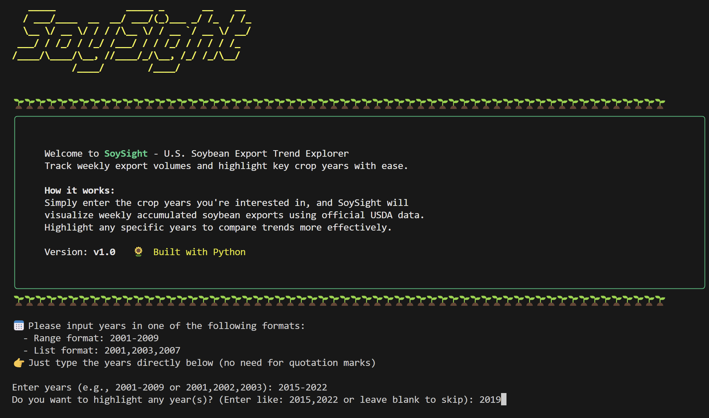
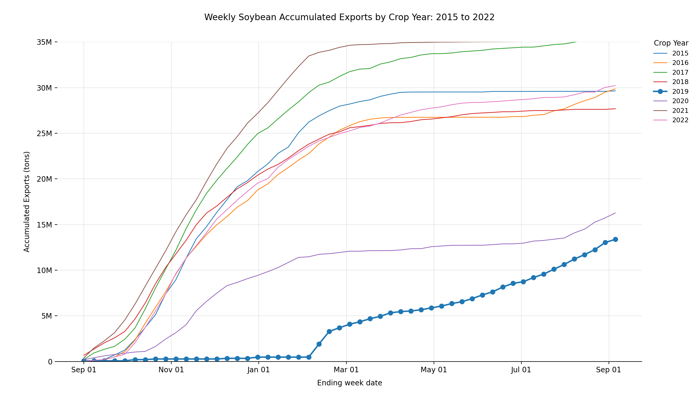

# SoySight: U.S. Soybean Export Trend Explorer

## Overview

**SoySight** is a Python-based terminal tool designed to visualize weekly accumulated soybean exports by crop year. By leveraging USDA's open data API, SoySight allows users to interactively input crop years of interest and generate export trend line charts with optional year highlighting.

## Features

* ✨ ASCII-stylized welcome screen with colorful Rich-based animations
* 📊 Visualize export trends for one or multiple crop years
* 🔍 Highlight key years to compare trends more clearly
* 📅 Automatically formats X-axis by month and Y-axis in metric tons
* 🚀 Built with pandas, matplotlib, pyfiglet, and rich

---

## Usage

### Step 1: Clone the repo

```bash
git clone https://github.com/WireFoxTerrier/SoySight.git
cd SoySight
```

### Step 2: Install dependencies

```bash
pip install -r requirements.txt
```

### Step 3: Set your USDA API key

Create a `.env` file in the root folder (same directory as `Run-Example-Script.py`) and add your USDA API key:

```
API_KEY=your_actual_key_here
```

> 🛡️ **Note:** The `.env` file is excluded from version control via `.gitignore` to keep your key private. See `.env.example` for the format.

### Step 4: Run the tool

```bash
python Run-Example-Script.py
```

### Example interaction

```bash
🔲 Please input years in one of the following formats:
 - Range format: 2010-2020
 - List format: 2015,2018,2021
📅 Just type the years directly below (no need for quotation marks)
Enter years: 2015-2022
Do you want to highlight any year(s)? (Enter like: 2018,2022 or leave blank to skip): 2019
```

A line chart will be generated like this:

## Example Output

Welcome Interface:



Result Visualization:



---

## Project Structure

```
soybean-export-trend/
├── soybean_report/
│   ├── __init__.py              # Package initializer
│   ├── welcome.py               # Launch screen animation (SoySight banner)
│   ├── year_list.py             # User input and validation
│   ├── usda_export_fetcher.py   # API requests to USDA and data retrieval
│   ├── plot_exports.py          # Matplotlib chart rendering logic
├── Run-Example-Script.py        # Main script to run the program
├── .env.example                 # Sample environment variable file (not tracked)
├── requirements.txt             # All necessary dependencies
├── .gitignore                   # Prevents sensitive files from being committed
```

---

## Dependencies

* `pandas`
* `matplotlib`
* `seaborn`
* `pyfiglet`
* `rich`
* `requests`
* `python-dotenv`

Install them all via:

```bash
pip install -r requirements.txt
```

---

## Notes

* SoySight fetches data in real-time from [USDA FAS Export API](https://apps.fas.usda.gov/OpenData/)
* Crop year is interpreted as starting from Sept 1 of the previous calendar year
* X-axis assumes 4.28 weeks per month for visual consistency

---

## License

MIT License. See `LICENSE` file for details.

---

## Acknowledgments

Built proudly by Brian Ju using USDA's public data 🌿 and the power of Python 🐇.
